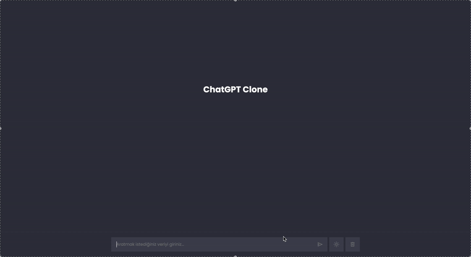
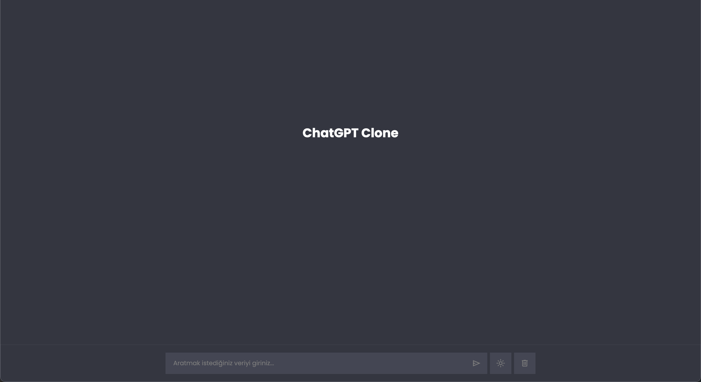
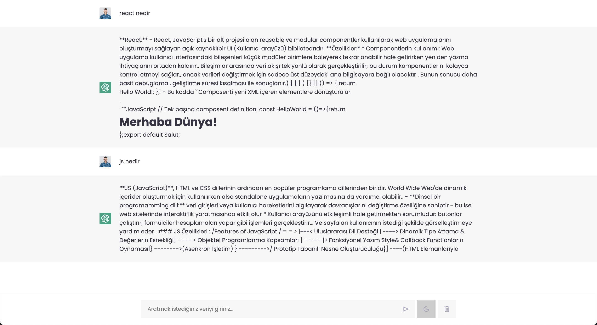
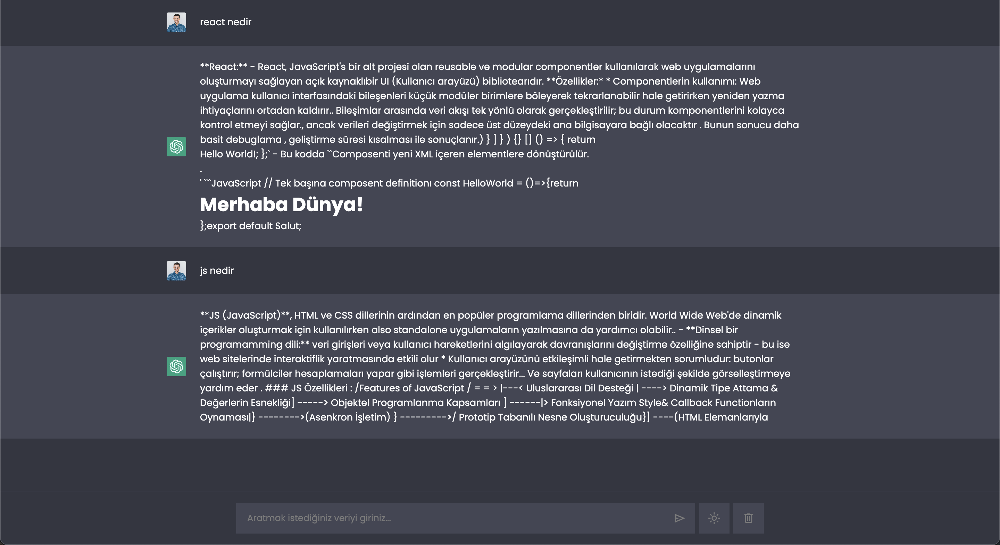

# ChatGPT Clone Application

## Introduction

This project is a ChatGPT clone application developed solely with HTML, CSS, and JavaScript. The app provides a real-time user experience by fetching data from Rapid API. Note: Due to the limited usage quota of the API, errors may occur after a certain number of requests.

## Screenshots

## screenrecord gif



### main page



### result-light-mode



### result-dark-mode



## Features

- Dark and Light Mode Support: Users can switch between dark and light themes for the page.
- Real-Time User Experience: Data fetched from Rapid API is displayed to the user in real time.
- User-Friendly Interface: Consistent styling is achieved with CSS :root variables, offering a seamless design across the page.
- Font and Icon Support: Google Fonts and Font Awesome are used to enhance the visual design.

## Technologies Used

- HTML: Structures the basic layout of the page.
- CSS: Styled with :root variables in the style.css file for consistent design control.
- JavaScript: All functionality is implemented in main.js. Fetch requests to the API are used to retrieve responses, which are displayed in real time.

## Project Structure

- index.html: Contains the main page of the application.
- style.css: Manages all styling and theme support.
- main.js: Includes API requests and all interactive features of the app.

## Libraries and Tools Used

- Google Fonts
- Font Awesome
- Rapid API - Used for data requests. Note: Due to API limitations, errors may occur after a certain number of requests.

### How to Run

- Clone or download the project to your computer.
- Open the index.html file in a web browser to view the main page.
- Click on any product to view its details on the detail page.

## Installation

1. Clone this repository to your local machine:
   ```
   git clone https://github.com/ozerbaykal/ChatGBT-clone.git
   ```
2. Open the `index.html` file in your preferred browser to view the project.

### Developer Notes
Please keep in mind the limited number of API requests available. To make more requests, consider upgrading the subscription plan with the API provider.

<h2>Contributing</h2>

Contributions are welcome! Please open an issue first to discuss what you would like to change.

- 1.Fork the project
- 2.Create your feature branch (git checkout -b feature/NewFeature)
- 3.Commit your changes (git commit -m 'Add new feature')
- 4.Push to the branch (git push origin feature/NewFeature)
- 5.Open a Pull Request

<h2>Contact</h2>

Özer BAYKAL mail : baykalozer87@gmail.com

Project Link:https://github.com/ozerbaykal/ChatGBT-clone
